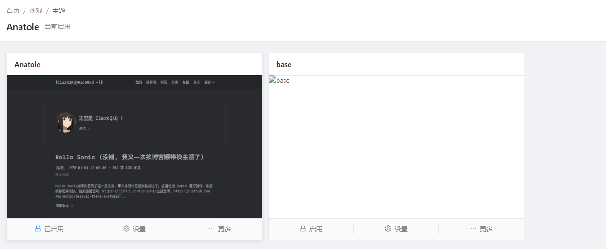

# 基本信息

在主题根目录的`theme.yaml`或`theme.yml`中设置我们主题的基本信息，将会在`主题设置>关于`页面展示出来

<figure><figcaption></figcaption></figure>

```yaml
id: caicai_anatole
name: Anatole
author:
  name: Caicai
  website: https://www.caicai.me
description: Sonic Default Theme
logo: https://avatars1.githubusercontent.com/u/1811819?s=460&v=4
website: https://github.com/go-sonic/default-theme-anatole
repo: https://github.com/go-sonic/default-theme-anatole
version: 1.5.0-alpha.2
require: 1.0.5
```

**使用yaml语法进行定义**

* id: 对应图中的`主题标识`，用于引擎识别不同的主题
* name: 即主题名称
* author: 主题作者信息
  * name：对应图中的`作者`
  * website：作者个人网站
  * avatar：作者个人头像链接
* description: 对应图中的`介绍`，主题描述信息
* logo: 图标，对应图中`作者`上方的头像
* website: 主题官网，对应图中`官网`
* repo: 主题仓库，对应图中`Git仓库`，用于主题自动更新
* updateStrategy：主题更新策略，0为从分支的commit更新，1为从release更新（可能）
* branch：如从分支更新，指定所在主题仓库的分支
* version: 主题版本，对应图中`当前版本`
* require: 主题所需的sonic版本
